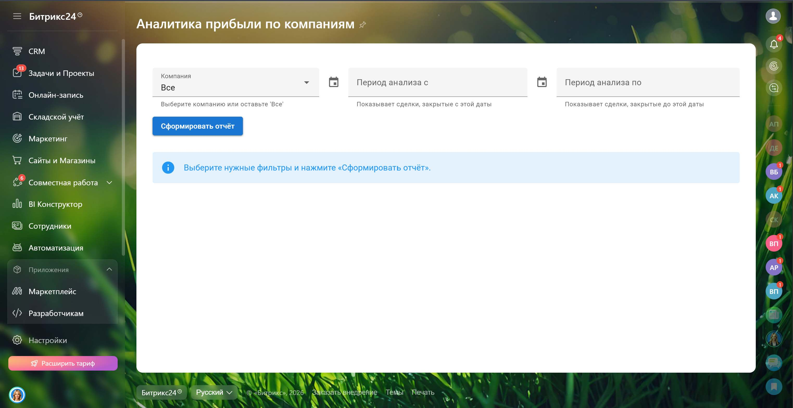
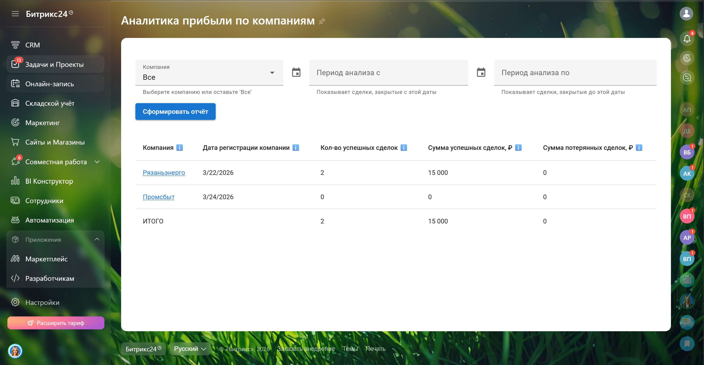
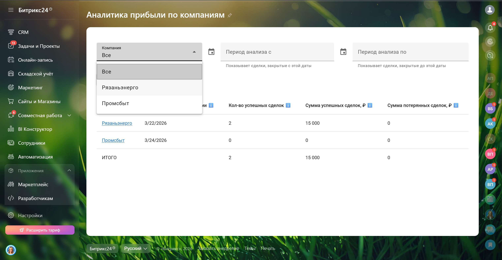
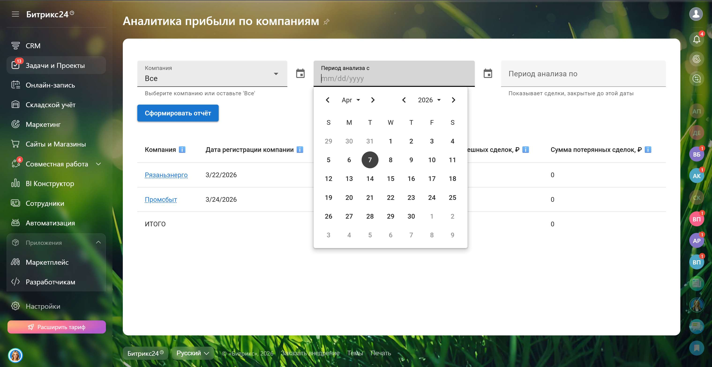

<h1 align="center">Отчёт по прибыли и сделкам по компаниям 💰</h1>

 
 Инструмент для анализа прибыли и сделок по компаниям в <b>Bitrix24</b>.  Позволяет оценивать эффективность работы с клиентами и выявлять наиболее прибыльные компании 
 
 <b>📊 Анализ прибыли • 💼 Оценка эффективности • 🏆 Выявление лидеров по доходу</b> 
 
 <h2>🎥 Демонстрация</h2> 
 <table width="100%" cellpadding="1" border="1"> <tr align="center"> <td>   <em>Работа приложения в реальном времени</em> </td> </tr> </table> 
   <table width="100%"> <tr> <td align="center">   <em>Начальный экран</em> </td> <td align="center">   <em>Вывод данных по компаниям</em> </td> </tr> <tr> <td align="center">   <em>Фильтр по конкретной компании</em> </td> <td align="center">   <em>Фильтр по периоду</em> </td> </tr> </table> 
 <h2>🧩 Контекст задачи</h2> 
 Клиенту было важно видеть, какие компании приносят наибольший доход и оценивать эффективность работы с клиентами. Необходимо было оперативно анализировать заключённые и незаключённые сделки, чтобы принимать решения на основе данных. 
 
 <h2>💡 Что было реализовано</h2> <ul> <li>Сбор и анализ данных по сделкам в разрезе компаний</li> <li>Отображение суммы заключённых и незаключённых сделок</li> <li>Фильтрация данных по компании и периоду</li> <li>Визуализация прибыли и эффективности работы с клиентской базой</li> </ul> 
 <h2>⚙️ Логика работы</h2> <ul> <li>Отчёт показывает общую прибыль по каждой компании</li> <li>Возможность фильтровать данные по конкретной компании и выбранному периоду</li> <li>Сразу видно, какие компании приносят наибольший доход, а какие требуют внимания</li> </ul> 
 <h2>📊 Метрики отчета</h2> <table> <tr> <th>Показатель</th> <th>Описание</th> </tr> <tr> <td>Компания</td> <td>Название компании</td> </tr> <tr> <td>Дата создания</td> <td>Дата регистрации компании в CRM</td> </tr> <tr> <td>Кол-во сделок</td> <td>Количество заключённых сделок</td> </tr> <tr> <td>Сумма сделок</td> <td>Общая сумма заключённых сделок</td> </tr> <tr> <td>Неуспешные сделки</td> <td>Сумма незаключённых сделок</td> </tr> </table> 
 <h2>🛠 Технологический стек</h2> <table width="100%" cellpadding="10"> <tr> <td align="center">   <b>Vue.js</b> </td> <td align="center">   <b>Vuetify</b> </td> <td align="center">   <b>TypeScript</b> </td> <td align="center">   <b>Vite</b> </td> <td align="center">   <b>CSS</b> </td> <td align="center">   <b>Bitrix24 REST API</b> </td> </tr> </table> 
 <h2>📩 Контакты</h2> 
 Telegram: <a href="https://t.me/volodin7ergey">@volodin7ergey</a>  VK: <a href="https://vk.com/volodin7ergey">vk.com/volodin7ergey</a> 
 
 <b>Готов разработать аналогичные решения под Ваши бизнес-процессы 💼</b> 

