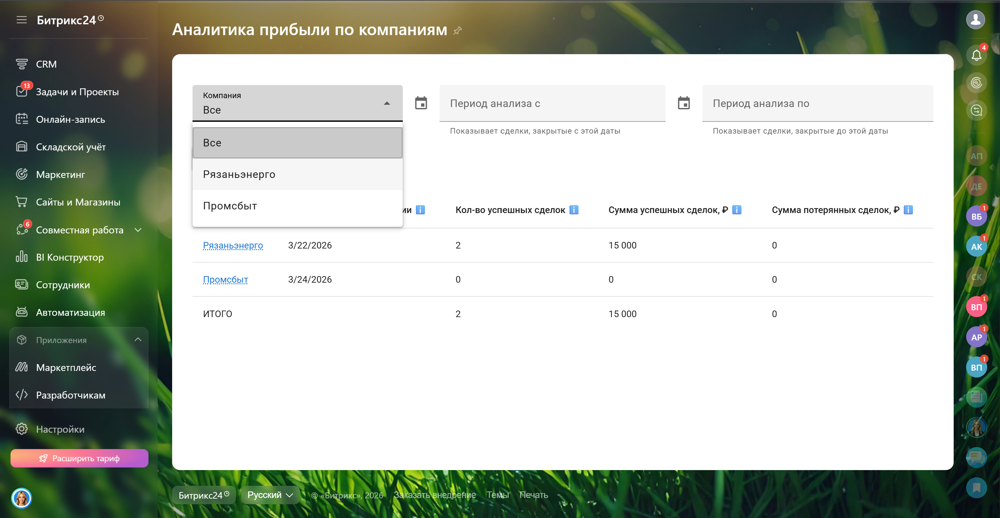
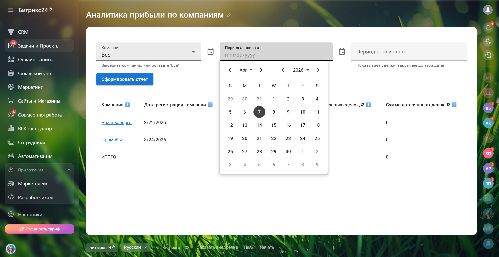

<h1>Отчет по прибыли и сделкам по компаниям</h1>

Инструмент для анализа прибыли по компаниям в <b>Bitrix24</b>. 
Позволяет оценивать эффективность работы с клиентами и видеть, какие компании приносят наибольший доход.

<h2>🔹 Демонстрация работы приложения</h2>

<table width="100%" cellpadding="1" border="1">
<tr align="center"><td>  

<em >Работа приложения в реальном времени</em></td></tr>
</table>

<table>

<tr>
<td align="center">
 
<em>Начальный экран</em>
</td>

<td align="center">
 
<em>Вывод данных по компаниям</em>
</td>
</tr>

<tr>

<td align="center">
 
<em>Фильтр по конкретной компании</em>
</td>

<td align="center">
 
<em>Фильтр по периоду</em>
</td>
</tr>
</table>

<h2>🔹 Проблема</h2>

Клиент столкнулся с необходимостью:

<ul>
<li>Отслеживать, сколько прибыли приносит каждая компания</li>
<li>Анализировать эффективность работы с клиентами за период</li>
<li>Разделять успешные и неуспешные сделки для принятия решений</li>
</ul>

<h2>🔹 Решение</h2>

Разработал приложение, которое позволяет:

<ul>
<li>Собирать данные по сделкам в разрезе компаний</li>
<li>Анализировать сумму заключенных и незаключенных сделок</li>
<li>Оценивать эффективность работы с клиентской базой</li>
<li>Фильтровать данные по периоду и компаниям</li>
</ul>

<h2>🔹 Показатели отчета</h2>

<table>
<tr>
<th>Показатель</th>
<th>Описание</th>
</tr>
<tr>
<td>Компания</td>
<td>Название компании</td>
</tr>
<tr>
<td>Дата создания</td>
<td>Дата регистрации компании в CRM</td>
</tr>
<tr>
<td>Кол-во сделок</td>
<td>Количество заключенных сделок</td>
</tr>
<tr>
<td>Сумма сделок</td>
<td>Общая сумма заключенных сделок</td>
</tr>
<tr>
<td>Неуспешные сделки</td>
<td>Сумма незаключенных сделок</td>
</tr>
</table>

<b>Итоги:</b>

<ul>
<li>Общее количество заключенных сделок</li>
<li>Сумма заключенных сделок</li>
<li>Сумма незаключенных сделок</li>
</ul>

<b>Фильтры:</b>

<ul>
<li>Период (по дате завершения сделки)</li>
<li>Компания</li>
</ul>

<h2>🔹 Использованные технологии</h2>

<ul>
<li><b>Frontend:</b> Vue + Vuetify, JavaScript, Sass, Vite</li>
<li><b>Интеграция:</b> Bitrix24 API</li>
<li><b>Было выделено времени:</b> 6 дней</li>
<li><b>Время разработки:</b> 5 дней разработка + 1 день тестирование</li>
</ul>

<h2>🔹 Результат</h2>

<ul>
<li>Прозрачная аналитика по прибыли в разрезе компаний</li>
<li>Быстрое выявление наиболее прибыльных клиентов</li>
<li>Возможность принимать решения на основе данных</li>
</ul>

<h2>🔹 Контакты</h2>

Если заинтересовало или хотите аналогичное приложение:  

Telegram: <a href="https://t.me/volodin7ergey">@volodin7ergey</a> 
VK: <a href="https://vk.com/volodin7ergey">vk.com/volodin7ergey</a>

